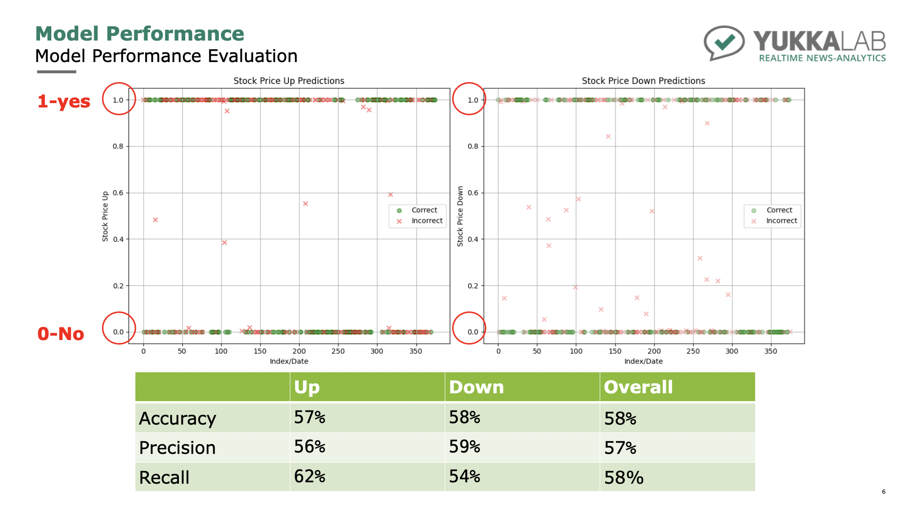

# Anticipate Events Based On Events Using Neural Network

This is one of the main projects I worked on with my supervisor Alex during my internship at Yukka Lab in Berlin, Germany in the Summer of 2024. Yukka Lab extracts news articles everyday for the companies of interested. For each news article extracted, their model is able to detect the specific 'events' mentioned or implied in this article that are from the list of events we are interested at. In this project, I aim to predict the future events of any company based on the current events we have for this company.

The end product model I built in this project predicted stock price up and stock price down for Q3 2023 to Q3 2024. Based on my model accuracy of approximately 58%, more hyperparameter tuning and optimization would be necessary prior to deployment for Yukka Lab to publish findings/reallocate resources/streamline operations.

## Example
For a company, the events for 3 consecutive weeks might look like : 
- Week 1 : Investigation, Plant Closure
- Week 2 : Law Suit, CEO Stepping Down
- Week 3 : Stock Price Down
So the time frame for our model could be like if we use events from day 0-7 as input, we will get events prediction for the 8th day.

## Dataset
We chose the company 'Apple Inc.' from 2020-01-01 to 2023-07-10 to be the training set, and 2023-07-10 to 2024-07-21 to be the testing set. The original dataset gives us information in format : date - event name - frequency. We converted training set by using one-hot encoding so that if an event's frequency is equal or greater than a threshold (We chose Median, there is not much difference using Median, Mean, or Mode), this event is indicated 1, otherwise 0. 

## Multilayer Neural Network
- Input Layer : 1285 (dates) x 119 (events)
- Hidden Layer 1 : 119 x 1000
- Hidden Layer 2 : 1000 x 64
- Output Layer : 64 x 2 (1 or 0)

### Hyperparameter Tuning
Optimal Parameters (lower loss value preferred) : 
- n_epochs = 250
- batch_size = 5
- hidden_layers = [1000, 64]
- Activation = relu
- Result : Loss <= 0.528

Notes 
1. Loss tends to be stable as number of epoch approaches 500
2. But if it getting too big, there will be potential overfitting problem

## Model Performance
We chose 2 events 'Stock Price Up' and 'Stock Price Down' to evaluate our model performance. That is, given the previous 7 days of events as input, will 'Stock Price Up' or 'Stock Price Down' events appear in the 8th day?

## Improvement
1. We may need to work on finding the optimal length of time frame for input
2. Events detected in an article does not necessarily mean it is happening already, or it is actually happening sometimes
3. We could add more companies of interest for training and evaluation
4. Try LSTS model that allows wider time frame and also use sequence of data instead of individual data points

